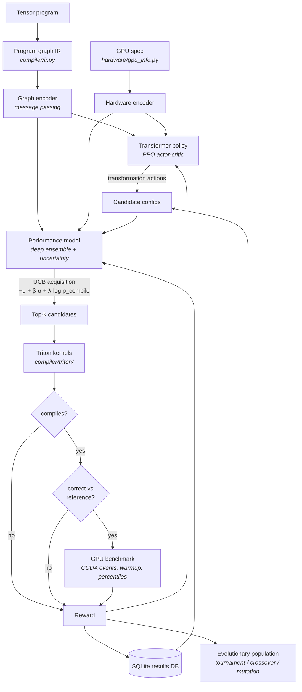

# gpu-optimizer

[](https://github.com/sunkalpchandra/gpu-optimizer/actions/workflows/ci.yml)
[](https://sunkalpchandra.github.io/gpu-optimizer/)

**An autonomous GPU kernel optimization agent.** Given a tensor program
(matmul, softmax, attention, …), it searches the space of real Triton kernel
implementations — tiling, warp/stage configuration, memory strategy, fusion,
precision — compiles candidates, runs them on the GPU, verifies them against
trusted references, and **learns from the measurements**: a PPO policy learns
which transformations pay off, a deep-ensemble surrogate learns to predict
runtime before compiling, and an evolutionary population keeps the search
honest. The central question:

> Can an ML system learn to search the enormous optimization space of GPU
> programs more intelligently than hand-designed search heuristics?

```bash
python optimize.py --task matmul --size 4096
```

## Why GPU kernel optimization is hard

A single matmul kernel has thousands of valid configurations
(`BLOCK_M/N/K × GROUP_M × num_warps × num_stages × dtype` ≈ 7,000 here — and
that's one op, one shape, one GPU). The performance surface is:

- **Non-convex and cliffy** — one step in tile size can double runtime
  (occupancy collapse, register spilling, shared-memory overflow);
- **Hardware-conditional** — the best A100 config can *fail to compile* on an
  RTX 4090 (less shared memory per SM);
- **Shape-conditional** — tile quantization punishes configs that were optimal
  one size down;
- **Expensive to probe** — every real measurement costs a compile + benchmark,
  so brute force doesn't scale and sample efficiency is the whole game.

## Architecture



The **hybrid optimizer** (default) runs all three learners against the same
measurement stream: the PPO searcher gets a reserved slice of every benchmark
batch (its episodes must touch real hardware), while evolutionary offspring
and random immigrants are pre-screened by the surrogate's uncertainty-aware
acquisition so most bad candidates die on paper instead of on the GPU.

## RL formulation

- **State** — program graph embedding ⊕ hardware embedding ⊕ current config
  encoding ⊕ search scalars (steps left, log-improvement so far), fused by a
  small transformer over the four tokens
  ([optimizer/policy/policy_net.py](optimizer/policy/policy_net.py)).
- **Actions** — a fixed structured catalog
  ([compiler/transformations/actions.py](compiler/transformations/actions.py)):
  increase/decrease each tiling parameter, step precision or strategy, STOP —
  with per-state validity masks. A Gaussian head stands ready for continuous
  parameters. The policy never emits free-form source.
- **Reward** — `log₂(t_prev / t_new)` per accepted edit (telescopes to the
  episode's total speedup), −0.5 for failed candidates, small step penalty.
  Configurable in [optimizer/rewards/reward.py](optimizer/rewards/reward.py);
  a faster-but-*incorrect* kernel earns the correctness penalty, never its
  speedup.
- **Algorithm** — PPO with GAE, clipped objective, entropy bonus, KL early
  stop ([optimizer/rl/ppo.py](optimizer/rl/ppo.py)). Transitions stream in
  asynchronously as benchmark results return; the policy improves *during*
  the search.

## Search space

Per task ([compiler/transformations/space.py](compiler/transformations/space.py)):

| Task | Parameters |
|---|---|
| matmul | BLOCK_M/N/K, GROUP_M (L2 reuse), num_warps, num_stages, dtype (fp32/tf32/fp16/bf16) |
| attention | BLOCK_M/N (flash tiling), num_warps, num_stages, dtype |
| softmax / layernorm | BLOCK_N (single-tile vs online/two-pass), num_warps, num_stages, dtype |
| reduction | BLOCK_SIZE, num_warps, strategy (loop / atomic / two_pass) |
| fused elementwise | BLOCK_SIZE, num_warps, **fusion strategy** (fused / unfused), dtype |
| vecadd | BLOCK_SIZE, num_warps, dtype |

Every config maps to a real `@triton.jit` kernel launch
([compiler/triton/kernels.py](compiler/triton/kernels.py)) — grouped-ordering
matmul, flash-style attention with online softmax, Welford-free two-pass
layernorm, atomic/two-pass reductions.

## Performance model

A deep ensemble ([optimizer/performance_model/model.py](optimizer/performance_model/model.py))
maps *(program graph, hardware spec, candidate config)* →
**log-runtime, log-memory, P(compile)**, with ensemble spread as epistemic
uncertainty. Acquisition `−μ_log + β·σ_log + λ·log p_compile` (or Thompson
sampling across members) deliberately spends part of the budget on
uncertain-but-promising candidates. Trained continuously from the results DB;
the compile head learns hazards like shared-memory overflow so the search
stops proposing them.

## Evolutionary component

Steady-state GA ([optimizer/evolutionary/ga.py](optimizer/evolutionary/ga.py)):
tournament selection over every evaluated genome, uniform crossover, step/reset
mutation on the ordered choice lists, random immigrants, elitism by
construction. Fitness is the reward, so incorrect/uncompilable genomes breed
themselves out.

## Benchmarking methodology

[benchmarks/harness.py](benchmarks/harness.py):

- CUDA-event timing per iteration, explicit `torch.cuda.synchronize()`,
  configurable warmup (default 20) and iterations (default 100);
- median / mean / p50 / p90 / p99 / std / min latency, throughput, peak
  memory, compile time — all persisted to SQLite
  ([benchmarks/db.py](benchmarks/db.py)) with candidate ID, config, GPU,
  engine label, correctness mode, provenance, lineage and timestamps;
- **correctness first**: every candidate is checked against the PyTorch
  reference with dtype-aware tolerances
  ([compiler/validation/correctness.py](compiler/validation/correctness.py))
  *before* any reward-bearing measurement;
- baselines recorded per run: PyTorch (cuBLAS/SDPA/native) and Triton-naive
  (the task's default config).

### No GPU? Simulated engine — clearly labeled

Without CUDA, a deterministic analytic roofline-with-inefficiencies model
([optimizer/world_model/analytic.py](optimizer/world_model/analytic.py))
stands in so the full loop is developable anywhere, and candidate *algorithms*
are still verified by CPU emulation
([compiler/validation/emulation.py](compiler/validation/emulation.py)).
Every simulated number carries `engine="simulated"` through the DB, API, CLI
and UI. **Simulated results are never presented as hardware measurements.**

## Installation

```bash
git clone https://github.com/sunkalpchandra/gpu-optimizer
cd gpu-optimizer
python -m venv .venv && source .venv/bin/activate
pip install -e ".[dev,server]"       # + on CUDA machines: pip install -e ".[gpu]"
python -m pytest                     # GPU tests auto-skip without CUDA
```

## Running an optimization

```bash
# flagship demo
python optimize.py --task matmul --size 4096

# other tasks / algorithms
python optimize.py --task attention --size 2048 --algorithm hybrid --budget 300
python optimize.py --task reduction --size 16777216 --algorithm evolutionary
python optimize.py --task softmax --size 2048 --show-source

# warm starts: successive runs reuse per-task surrogate + policy checkpoints
python optimize.py --task matmul --size 4096 --warm

# train a surrogate checkpoint from the accumulated results DB
# (refuses to save one whose held-out ranking is weak)
python scripts/train_surrogate.py --out checkpoints/surrogate.pt

# reproducible experiments from YAML
python scripts/run_search.py configs/matmul_hybrid.yaml

# generalization study suite → reports/
python scripts/generalization.py
```

## Example results

From [reports/](reports/) — produced by the **simulated engine** on this
machine (no CUDA GPU), so these validate *search behavior and transfer*, not
hardware speedups. Matmul 2048³, equal budget of 80 evaluations per
algorithm, identical seeds:

| algorithm | best latency (sim) | evals to best | compile rate |
|---|---|---|---|
| random | 0.0636 ms | 32 | 100% |
| evolutionary | 0.0620 ms | 67 | 98.8% |
| bayesian (UCB) | 0.0604 ms | 80 | 100% |
| rl (PPO) | 0.0639 ms | 38 | 100% |
| **hybrid** | 0.0609 ms | **22** | 100% |

Surrogate generalization (train → unseen): shape interpolation Spearman
**0.86–0.90**, extrapolation to 4096³ **0.88**, hardware transfer
A100→RTX-4090 rank correlation **0.80** with the transferred best config 9.4%
off native-search best. Workload transfer is honestly weak for
softmax/layernorm (ρ 0.18–0.35) — training on matmul/elementwise does not
teach row-reduction workloads; attention transfers better (ρ 0.68) since it
shares matmul structure.

On a CUDA machine the identical commands benchmark real kernels; large
simulated "speedups" mostly reflect precision switching (fp16/bf16 tensor
cores vs an fp32 baseline) plus tiling effects, and real-hardware numbers
should be reported from real runs only. No claim is made here of beating
cuBLAS/FlashAttention on hardware.

## Dashboard

**Live demo: <https://sunkalpchandra.github.io/gpu-optimizer/>** — a static
snapshot of recorded (simulated-engine) runs deployed to GitHub Pages; the UI
says so up front, and launching new searches needs the local backend:

```bash
uvicorn server.api.main:app --port 8000     # backend (serves frontend/dist if built)
cd frontend && npm install && npm run dev   # dev UI at :5173
```

Overview (best speedup, benchmarks, compile rate) · live optimization run
view with predicted-vs-actual iterations · clickable search-tree lineage
visualization · kernel source viewer · GPU catalog metrics · generalization
reports. Simulated data is banner-flagged and every simulated number carries
a `sim` badge.

## Experiments & reproducibility

Every experiment is a YAML file ([configs/](configs/)) with seeds; identical
configs reproduce identical simulated runs bit-for-bit and statistically
equivalent hardware runs. The generalization suite
([optimizer/experiments/generalization.py](optimizer/experiments/generalization.py))
covers shape interpolation/extrapolation, workload transfer, hardware
transfer (top-K protocol — top-1 can legitimately fail to compile across
GPUs), and equal-budget search efficiency.

## Limitations

- **Structured configs, not code synthesis** — the agent tunes parameterized
  Triton templates; it does not invent new loop structures or emit arbitrary
  kernels. That is the honest scope of the action space.
- **Simulated engine ≠ hardware** — it is a deterministic development model
  with plausible qualitative structure (occupancy, quantization, spilling,
  pipelining); its absolute numbers and exact optima differ from real GPUs,
  which is why every such number is labeled.
- **CUDA backend is minimal** — Triton is the primary backend; raw-CUDA
  codegen is limited to source rendering hooks.
- **Single-GPU search** — no distributed benchmarking; hardware-transfer
  studies across *real* GPUs require multiple machines.
- **PPO sample efficiency** — with only hundreds of real measurements per
  run, PPO's edge over the surrogate+GA combination is modest; the hybrid's
  value is that each component covers the others' failure modes.

## Project structure

```text
optimizer/        rl/ policy/ world_model/ performance_model/ evolutionary/ search/ rewards/ experiments/
compiler/         ir.py triton/ cuda/ transformations/ validation/
benchmarks/       7 tasks · harness.py (engines) · db.py (SQLite)
hardware/         gpu_info.py (detection, catalog, embeddings)
server/api/       FastAPI backend
frontend/         React + TypeScript + Tailwind dashboard
configs/ scripts/ tests/ reports/ data/
```

MIT License.
